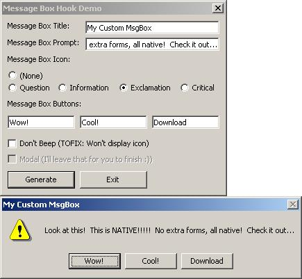



## Fixed: Cool Message Boxes

### Description

Fixed version: customizes your message box buttons by hooking!
 
### More Info
 

             |
---                |---
**Submitted On**   |2002-02-22 15:18:36
**By**             |[Andy Matteson](https://github.com/Planet-Source-Code/PSCIndex/blob/master/ByAuthor/andy-matteson.md)
**Level**          |Advanced
**User Rating**    |5.0 (20 globes from 4 users)
**Compatibility**  |VB 5\.0, VB 6\.0
**Category**       |[Windows API Call/ Explanation](https://github.com/Planet-Source-Code/PSCIndex/blob/master/ByCategory/windows-api-call-explanation__1-39.md)
**World**          |[Visual Basic](https://github.com/Planet-Source-Code/PSCIndex/blob/master/ByWorld/visual-basic.md)
**Archive File**   |[Fixed\_\_Coo569172222002\.zip](https://github.com/Planet-Source-Code/andy-matteson-fixed-cool-message-boxes__1-32038/archive/master.zip)

